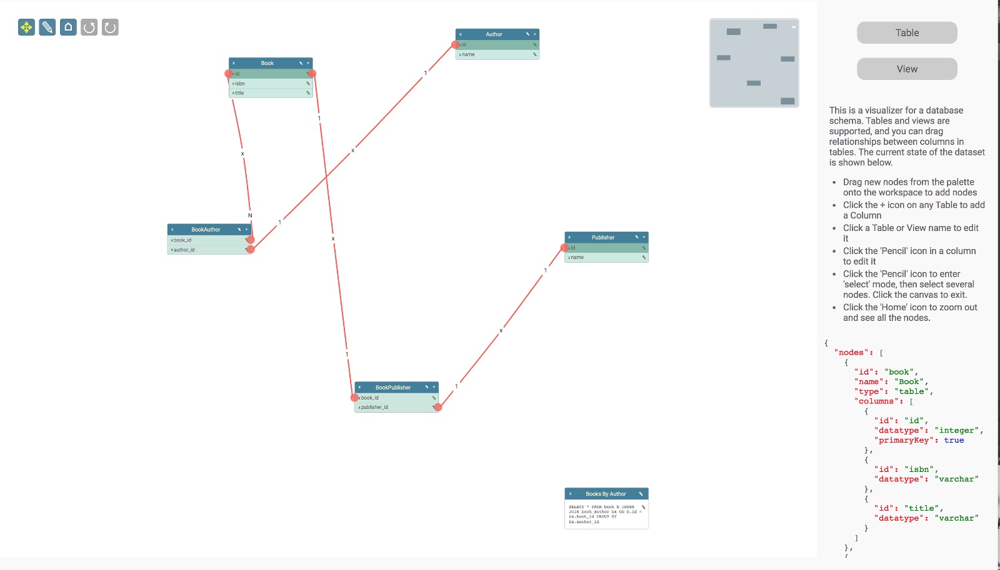
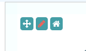

## Database Visualizer (React)

This is a port of the Database Visualizer application that demonstrates the Toolkit's React integration. 

- [package.json](#package)
- [Page Setup](#setup)
- [Webpack Setup](#webpack-setup)
- [Bootstrap](#bootstrap)
- [Demo Component](#demo-component)    
- [Database Visualizer Component](#database-visualizer-component)
    - [Declaration](#flowchart-component-declaration)
    - [Rendering Parameters](#renderParams)
    - [View](#view)    
    - [Rendering Tables and Views](#rendering-tables-and-views)
    - [Rendering Table Columns](#rendering-columns)
    - [Dragging New Nodes](#dragging)
    - [Selecting Nodes](#selecting)
- [Dataset Component](#dataset-component)  
- [Controls Component](#controls-component)  
- [Dialogs](#dialogs)




This page gives you an in-depth look at how the application is put together.

<a name="package"></a>
### package.json

```json
{
  "name": "jsplumbtoolkit-react",
  "version": "2.3.0",
  "description": "Integration between jsPlumb Toolkit and React",
  "main": "index.js",
  "author": "jsPlumb <hello@jsplumbtoolkit.com> (https://jsplumbtoolkit.com)",
  "license": "Commercial",
  "scripts": {
    "build": "node ./node_modules/webpack/bin/webpack.js",
     "start": "webpack-dev-server"
  },
  "dependencies": {
    "react": "^17.0.0",
    "react-dom": "^17.0.0",
    "jsplumbtoolkit": "file:./jsplumbtoolkit.tgz",
    "jsplumbtoolkit-react": "file:./jsplumbtoolkit-react.tgz",
    "jsplumbtoolkit-drop": "file:./jsplumbtoolkit-drop.tgz",
    "jsplumbtoolkit-react-drop": "file:./jsplumbtoolkit-react-drop.tgz",
    "jsplumbtoolkit-syntax-highlighter": "file:./jsplumbtoolkit-syntax-highlighter.tgz",
    "jsplumbtoolkit-demo-support": "file:./jsplumbtoolkit-demo-support.tgz"
  },
  "devDependencies": {
    "babel-core": "^6.22.1",
    "babel-loader": "^6.2.10",
    "babel-preset-es2015": "^6.22.0",
    "babel-preset-react": "^6.22.0",
    "webpack": "^2.4.1",
    "webpack-dev-server": "^2.4.1"
  }
}

```

There are seven entries specific to jsPlumb:

```json
{
  "jsplumbtoolkit": "file:./jsplumbtoolkit.tgz",
  "jsplumbtoolkit-react": "file:./jsplumbtoolkit-react.tgz",
  "jsplumbtoolkit-drop": "file:./jsplumbtoolkit-drop.tgz",
  "jsplumbtoolkit-react-drop": "file:./jsplumbtoolkit-react-drop.tgz",
  "jsplumbtoolkit-syntax-highlighter": "file:./jsplumbtoolkit-syntax-highlighter.tgz",
  "jsplumbtoolkit-demo-support": "file:./jsplumbtoolkit-demo-support.tgz"
}
```

The first of these is the jsPlumb Toolkit code, the second is the Toolkit's React integration, the third is the undo/redo manager, the fourth/fifth are the drop manager plus the React wrapper around it, and the last two are some helper packages used by our demonstrations. If you use this code as a basis for your own app these last two are not strictly required.

You will need to copy these into the project root from your licensed download or your evaluation download before you run `npm install`.


[TOP](#top)

---

<a name="setup"></a>
### Page Setup

#### CSS

We import 4 css files:

- `jsplumbtoolkit-syntax-highlighter.css`     For the Dataset component

- `jsplumbtoolkit.css`   Provides sane defaults for the Toolkit. You should start building your app with this in the cascade; you can
remove it eventually, of course, but you just need to ensure you have provided values elsewhere in your CSS. Generally the safest thing to
do is to just include it at the top of your cascade.

- `jsplumbtoolkit-demo-support.css`   Some basic common styles for all the demo pages.

- `app.css` The styles for Database Visualizer demonstration


[TOP](#top)

---

<a name="webpack-setup"></a>
### Webpack Setup

This is the `webpack.config.js` file used by this demonstration:

```javascript
var path = require('path');
 
module.exports = {
  entry: './src/index.jsx',
  output: { 
      path: path.join(__dirname, "dist"), 
      filename: 'bundle.js' 
    },
  module: {
    loaders: [
      {
        test: /.jsx?$/,
        loader: 'babel-loader',
        query: {
          presets: ['es2015', 'react']
        }
      }
    ]
  }
};
```

[TOP](#top)

---

<a name="bootstrap"></a>
### Bootstrap

The application is bootstrapped inside `src/index.jsx`:

```javascript
jsPlumbToolkit.ready(() => {

    const mainElement = document.querySelector("#jtk-demo-dbase"),
        nodePaletteElement = mainElement.querySelector(".node-palette"),
        miniviewElement = mainElement.querySelector(".miniview");

// ------------------------- dialogs ------------------------------------------------------------

    Dialogs.initialize({
        selector: ".dlg"
    });

    class DemoComponent extends React.Component {

        constructor(props) {
            
            ...
            
        }
    }
    
});

```


[TOP](#top)

---


<a name="demo-component"></a>
### Demo Component

The entry point to the demonstration is `index.jsx`. It consists of a `DemoComponent`, which is rendered as follows:

```javascript
ReactDOM.render(<DemoComponent/>, document.querySelector(".jtk-demo-canvas"));
```

This is the code for the demo component:

```javascript
class DemoComponent extends React.Component {

    constructor(props) {
        super(props);
        this.toolkit = jsPlumbToolkit.newInstance({
            nodeFactory: function (type, data, callback) {
                data.columns = [];
                Dialogs.show({
                    id: "dlgName",
                    title: "Enter " + type + " name:",
                    onOK: function (d) {
                        data.name = d.name;
                        // if the user entered a name...
                        if (data.name) {
                            if (data.name.length >= 2) {
                                data.id = jsPlumbUtil.uuid();
                                callback(data);
                            }
                            else
                                alert(type + " names must be at least 2 characters!");
                        }
                        // else...do not proceed.
                    }
                });
            },
            // the name of the property in each node's data that is the key for the data for the ports for that node.
            // we used to use portExtractor and portUpdater in this demo, prior to the existence of portDataProperty.
            // for more complex setups, those functions may still be needed.
            portDataProperty:"columns",
            //
            // Prevent connections from a column to itself or to another column on the same table.
            //
            beforeConnect:function(source, target) {
                return source !== target && source.getNode() !== target.getNode();
            }
        });

        this.view = {
            // NOTE two ways of providing a component (which also works for Port definitions).  TableComponent and
            // ViewComponent both extend the Toolkit's BaseNodeComponent. When you provide the `jsx` you should ensure
            // that you pass in `ctx` as a prop to any component that extends BaseNodeComponent/BaseGroupComponent.
            // When you use `component`, the Toolkit handles that for you.
            nodes: {
                "table": {
                    jsx: (ctx) => <TableComponent ctx={ctx} />
                },
                "view": {
                    component:ViewComponent
                }
            },
            // Three edge types  - '1:1', '1:N' and 'N:M',
            // sharing  a common parent, in which the connector type, anchors
            // and appearance is defined.
            edges: {
                "common": {
                    anchor: [ "Left", "Right" ], // anchors for the endpoints
                    connector: "StateMachine",  //  StateMachine connector type
                    cssClass:"common-edge",
                    events: {
                        "dbltap": (params) => {
                            this._editEdge(params.edge);
                        }
                    },
                    overlays: [
                        [ "Label", {
                            cssClass: "delete-relationship",
                            label: "<i class='fa fa-times'></i>",
                            events: {
                                "tap":  (params) => {
                                    this.toolkit.removeEdge(params.edge);
                                }
                            }
                        } ]
                    ]
                },
                // each edge type has its own overlays.
                "1:1": {
                    parent: "common",
                    overlays: [
                        ["Label", { label: "1", location: 0.1 }],
                        ["Label", { label: "1", location: 0.9 }]
                    ]
                },
                "1:N": {
                    parent: "common",
                    overlays: [
                        ["Label", { label: "1", location: 0.1 }],
                        ["Label", { label: "N", location: 0.9 }]
                    ]
                },
                "N:M": {
                    parent: "common",
                    overlays: [
                        ["Label", { label: "N", location: 0.1 }],
                        ["Label", { label: "M", location: 0.9 }]
                    ]
                }
            },
            // There is only one type of Port - a column - so we use the key 'default' for the port type
            // Here we define the appearance of this port,
            // and we instruct the Toolkit what sort of Edge to create when the user drags a new connection
            // from an instance of this port. Note that we here we tell the Toolkit to create an Edge of type
            // 'common' because we don't know the cardinality of a relationship when the user is dragging. Once
            // a new relationship has been established we can ask the user for the cardinality and update the
            // model accordingly.
            ports: {
                "default": {
                    component:ColumnComponent,
                    // NOTE: you can also use the `jsx` approach for ports.
                    //jsx:(ctx) => { return <ColumnComponent ctx={ctx}/> },
                    paintStyle: { fill: "#f76258" },		// the endpoint's appearance
                    hoverPaintStyle: { fill: "#434343" }, // appearance when mouse hovering on endpoint or connection
                    edgeType: "common", // the type of edge for connections from this port type
                    maxConnections: -1, // no limit on connections
                    dropOptions: {  //drop options for the port. here we attach a css class.
                        hoverClass: "drop-hover"
                    }
                }
            }
        };

        this.renderParams = {
            // Layout the nodes using an absolute layout
            layout: {
                type: "Spring",
                parameters: {
                    padding: [150, 150]
                }
            },
            miniview: {
                container: miniviewElement
            },
            // Register for certain events from the renderer. Here we have subscribed to the 'nodeRendered' event,
            // which is fired each time a new node is rendered.  We attach listeners to the 'new column' button
            // in each table node.  'data' has 'node' and 'el' as properties: node is the underlying node data,
            // and el is the DOM element. We also attach listeners to all of the columns.
            // At this point we can use our underlying library to attach event listeners etc.
            events: {
                edgeAdded:  (params) => {
                    // Check here that the edge was not added programmatically, ie. on load.
                    if (params.addedByMouse) {
                        this._editEdge(params.edge, true);
                    }
                }/*,
                canvasClick:  (e) => {
                    this.toolkit.clearSelection();
                }*/
            },
            dragOptions: {
                filter: "i, .view .buttons, .table .buttons, .table-column *, .view-edit, .edit-name, .delete, .add"
            },
            consumeRightClick: false,
            zoomToFit:true
        }
    }

    render() {
        return <div style={{width:"100%",height:"100%",display:"flex"}}>
                    <JsPlumbToolkitSurfaceComponent renderParams={this.renderParams} toolkit={this.toolkit} view={this.view} ref={ (c) => { if (c != null) this.surface = c.surface }}/>
                    <ControlsComponent ref={(c) => this.controls = c }/>
                    <div className="miniview"/>                        
                </div>
    }

    dataGenerator (el) {
        return {
            name:el.getAttribute("data-node-type"),
            type:el.getAttribute("data-node-type")
        };
    }

    componentDidMount() {
        this.toolkit.load({url:"data/schema-1.json"});
        this.controls.initialize(this.surface);

        ReactDOM.render(
            <DragDropNodeSource
                surface={this.surface}
                selector={"div"}
                container={nodePaletteElement}
                dataGenerator={this.dataGenerator}
            />
            , nodePaletteElement);

        ReactDOM.render(
            <JsPlumbToolkitMiniviewComponent surface={this.surface}/>, document.querySelector(".miniview")
        );

        ReactDOM.render(
            <DatasetComponent surface={this.surface}/>, document.querySelector(".dataset-placeholder")
        );
    }

    _editLabel (edge, deleteOnCancel) {
        Dialogs.show({
            id: "dlgText",
            data: {
                text: edge.data.label || ""
            },
            onOK: (data) => {
                this.toolkit.updateEdge(edge, { label:data.text || "" });
            },
            onCancel:() => {
                if (deleteOnCancel) {
                    this.toolkit.removeEdge(edge);
                }
            }
        });
    }

    _editEdge (edge, isNew) {
        Dialogs.show({
            id: "dlgRelationshipType",
            data: edge.data,
            onOK: (data) => {
                // update the type in the edge's data model...it will be re-rendered.
                // `type` is set in the radio buttons in the dialog template.
                this.toolkit.updateEdge(edge, data);
            },
            onCancel: () => {
                // if the user pressed cancel on a new edge, delete the edge.
                if (isNew) {
                    this.toolkit.removeEdge(edge);
                }
            }
        });
    }
}   
```

There are a few different things this component manages:

#### 1. Creating an instance of the jsPlumb Toolkit.

We do this in the constructor of the demo component:

```
class DemoComponent extends React.Component {

    constructor(props) {
        super(props);
        this.toolkit = jsPlumbToolkit.newInstance({
        
            ...
            
        });
    }
}
```

Three parameters are passed to the Toolkit's constructor.

- **nodeFactory** is a function that jsPlumb calls when a new node is dropped onto the canvas. The node factory is given the type of the node and any initial data (that was created via the `dataGenerator` plugged in to the drag/drop mechanism), and a callback function that should be called with the given data if the factory wishes to proceed. In our implementation we popup a dialog prompting the user for a node name, and if that name is two or more characters in length, we convert it to lower case and hit the callback. If the name is less than two characters in length we do not proceed.

- **portDataProperty** is the name of the property in each node's data that is the key for the data for the ports for that node. In this demonstration that property name is `columns`, ie. the underlying data object for some table node looks like this:
 
 ```javascript
{
    "id": "book",
    "name": "Book",
    "type": "table",
    "columns": [
        {
            "id": "id",
            "datatype": "integer",
            "primaryKey": true
        },
        {
            "id": "isbn",
            "datatype": "varchar"
        },
        {
            "id": "title",
            "datatype": "varchar"
        }
    ]
}
```

For more information about the `portDataProperty`, see [this page](data-model#port-property). 

- **beforeConnect** is a function that is called prior to any edge being added, which in this case returns false if the source and target columns of some prospective relationship belong to the same table. This results in the edge being aborted.

#### 2. Rendering the Toolkit instance to a Surface widget

We declare `this.view` and `this.renderParams` on the demo component. The `view` is the set of rendering and behaviour instructions for the various types of node/edge. The `renderParams` control the behaviour of the Surface widget. See below for the JSX that creates the Surface widget.

#### 3. Creating a `ControlsComponent` and `DatasetComponent`

These are demo specific bits of code - the controls component manages the mode the surface is in (pan/lasso), as well as the undo/redo manager.  The dataset component just provides a current view of the json in the dataset.

The full JSX for the demo component is:
 
```
render() {
    return <div style={{width:"100%",height:"100%",display:"flex"}}>
        <JsPlumbToolkitSurfaceComponent renderParams={this.renderParams} toolkit={this.toolkit} view={this.view} ref={ (c) => { if (c != null) this.surface = c.surface }}/>
        <ControlsComponent ref={(c) => this.controls = c }/>
        <div className="miniview"/>                        
    </div>
}
```

#### 4. Loading the initial data

We do this in `componentDidMount`. We know that this method will only be called one time in the life of this demonstration so it's safe to do it here - but only as an ajax call, as shown:

```javascript
componentDidMount() {
    this.toolkit.load({url:"data/schema-1.json"});
    ... 
}
```

If you try to load data directly, using `this.toolkit.load({data:..some json..})`, React will throw an error, as it's in the middle of a render and the act of loading data causes new React components to be created.


#### 5. Configuring a drag/drop manager

We do this in `componentDidMount`:

```javascript
componentDidMount() {
    
    ...
    
    ReactDOM.render(
        <DragDropNodeSource
            surface={this.surface}
            selector={"div"}
            container={nodePaletteElement}
            dataGenerator={this.dataGenerator}
        />
        , nodePaletteElement);
    
    ...
} 
```

#### 6. Configuring a miniview

We also do this in `componentDidMount`, the code for which is:

```javascript
componentDidMount() {
    
    ...

    ReactDOM.render(
        <JsPlumbToolkitMiniviewComponent surface={this.surface}/>, document.querySelector(".miniview")
    )
    
    ...
}
```


[TOP](#top)

---


<a name="renderParams"></a>
### Rendering Parameters

The parameters passed in to the Surface's constructor are:
 
 
```javascript
this.renderParams = {
    // Layout the nodes using an absolute layout
    layout: {
        type: "Spring",
        parameters: {
            padding: [150, 150]
        }
    },
    miniview: {
        container: miniviewElement
    },
    // Register for certain events from the renderer. Here we have subscribed to the 'nodeRendered' event,
    // which is fired each time a new node is rendered.  We attach listeners to the 'new column' button
    // in each table node.  'data' has 'node' and 'el' as properties: node is the underlying node data,
    // and el is the DOM element. We also attach listeners to all of the columns.
    // At this point we can use our underlying library to attach event listeners etc.
    events: {
        edgeAdded:  (params) => {
            // Check here that the edge was not added programmatically, ie. on load.
            if (params.addedByMouse) {
                this._editEdge(params.edge, true);
            }
        }
    },
    dragOptions: {
        filter: "i, .view .buttons, .table .buttons, .table-column *, .view-edit, .edit-name"
    },
    zoomToFit:true
}
```

- **layout** We use a [Spring (Force Directed)](layout-spring) layout in this demonstration.
- **events** We bind to the `edgeAdded` event, to [edit the label of new edges](#edit-new-edge).
- **dragOptions** There are a bunch of parts of the UI that we do not want to drag nodes by - all of the buttons on the table/view nodes and the columns.
- **zoomToFit** We instruct the surface to zoom so that everything is visible after the data is loaded.

[TOP](#top)

---

<a name="view"></a>
### View

The view contains the definitions of node/edge/port appearance and behaviour. We show both ways (`component` and `jsx` of mapping a component's visual representation):

```javascript
this.view = {
    nodes: {
        "table": {
            jsx: (ctx) => <TableComponent ctx={ctx} />
        },
        "view": {
            component: ViewComponent
        }
    },
    // Three edge types  - '1:1', '1:N' and 'N:M',
    // sharing  a common parent, in which the connector type, anchors
    // and appearance is defined.
    edges: {
        "common": {
            anchor: [ "Left", "Right" ], // anchors for the endpoints
            connector: "StateMachine",  //  StateMachine connector type
            cssClass:"common-edge",
            events: {
                "dbltap": (params) => {
                    this._editEdge(params.edge);
                }
            },
            overlays: [
                [ "Label", {
                    cssClass: "delete-relationship",
                    label: "<i class='fa fa-times'></i>",
                    events: {
                        "tap":  (params) => {
                            this.toolkit.removeEdge(params.edge);
                        }
                    }
                } ]
            ]
        },
        // each edge type has its own overlays.
        "1:1": {
            parent: "common",
            overlays: [
                ["Label", { label: "1", location: 0.1 }],
                ["Label", { label: "1", location: 0.9 }]
            ]
        },
        "1:N": {
            parent: "common",
            overlays: [
                ["Label", { label: "1", location: 0.1 }],
                ["Label", { label: "N", location: 0.9 }]
            ]
        },
        "N:M": {
            parent: "common",
            overlays: [
                ["Label", { label: "N", location: 0.1 }],
                ["Label", { label: "M", location: 0.9 }]
            ]
        }
    },
    ports: {
        "default": {
            component:ColumnComponent,
            // NOTE: you can also use the `jsx` approach for ports.
            //jsx:(ctx) => { return <ColumnComponent ctx={ctx}/> },
            paintStyle: { fill: "#f76258" },		// the endpoint's appearance
            hoverPaintStyle: { fill: "#434343" }, // appearance when mouse hovering on endpoint or connection
            edgeType: "common", // the type of edge for connections from this port type
            maxConnections: -1, // no limit on connections
            dropOptions: {  //drop options for the port. here we attach a css class.
                hoverClass: "drop-hover"
            }
        }
    }
}
```

[TOP](#top)

---

<a name="rendering-tables-and-views"></a>
### Rendering Tables and Views

Tables and Views are represented in the data model as types of node. In the view shown above, we see a mapping for each of these node types to their respective components:

```
nodes: {
  "table": {
    jsx: (ctx) => <TableComponent ctx={ctx} />
  },
  "view": {
    component: ViewComponent
  }
},
```

The two node types - view and table - extend `BaseComponent`, which offers methods to handle the removal of a node, and editing a node's name.

 
```javascript 
import React from 'react';
import { BaseNodeComponent }  from 'jsplumbtoolkit-react';
import { Dialogs } from 'jsplumbtoolkit';

export class BaseComponent extends BaseNodeComponent {

    constructor(props) {
        super(props);
    }

    deleteObject() {
        Dialogs.show({
            id: "dlgConfirm",
            data: {
                msg: "Delete '" + this.node.id
            },
            onOK: (data) => {
                this.removeNode();
            }
        })
    }

    editName() {        );
        Dialogs.show({
            id: "dlgName",
            data: this.node.data,
            title: "Edit " + this.node.data.type + " name",
            onOK: (data) => {
                if (data.name && data.name.length > 2) {
                    // if name is at least 2 chars long, update the underlying data and
                    // update the UI.
                    this.updateNode(data);
                }
            }
        });
    }
}
```

Note here that `BaseComponent` extends `BaseNodeComponent` from the Toolkit's React integration code. 

#### TableComponent

```javascript
import React from 'react';

import { Dialogs } from 'jsplumbtoolkit';
import { BaseComponent } from './base-component.jsx';
import { ColumnComponent } from './column-component.jsx';

export class TableComponent extends BaseComponent {

    constructor(props) {
        super(props);
    } 

    render() {

        return <div className="table node">
            <div className="name">
                <div className="delete" title="Click to delete" onClick={this.deleteObject.bind(this)}>
                    <i className="fa fa-times"/>
                </div>
                <span>{this.node.data.name}</span>
                <div className="buttons">
                    <div className="edit-name" title="Click to edit table name" onClick={this.editName.bind(this)}>
                        <i className="fa fa-pencil"/>
                    </div>
                    <div className="new-column add" title="Click to add a new column" onClick={this.addColumn.bind(this)}>
                        <i className="fa fa-plus"/>
                    </div>
                </div>
            </div>
            <ul className="table-columns">
                { this.node.data.columns.map(c => <ColumnComponent data={c} key={c.id} parent={this}/>) }
            </ul>

        </div>
    }

    addColumn() {
        Dialogs.show({
            id: "dlgColumnEdit",
            title: "Column Details",
            onOK:  (data) => {
                // if the user supplied a column name, tell the toolkit to add a new port, providing it the
                // id and name of the new column.  This will result in a callback to the portFactory defined above.
                if (data.name) {
                    if (data.name.length < 2)
                        alert("Column names must be at least 2 characters!");
                    else {
                        this.toolkit.addNewPort(this.node, "column", {
                            id: jsPlumbUtil.uuid(),
                            name: data.id.replace(" ", "_").toLowerCase(),
                            primaryKey: data.primaryKey,
                            datatype: data.datatype
                        });
                    }
                }
            }
        });
    }
}

```

Below, we discuss the`ColumnComponent` used to render each table column. We set 3 props on each `ColumnComponent`:

- **data={c}** The data for the port must be presented as `data` to the port renderer component
- **parent={this}** The port component expects a `parent` to be passed in, which must be of type `BaseNodeComponent`.
- **key={c.id}** React needs a unique key for each item in a loop, to help it make decisions about re-rendering.

#### ViewComponent

```javascript
import React from 'react';

import { Dialogs } from 'jsplumbtoolkit';

import { BaseComponent } from './base-component.jsx';

export class ViewComponent extends BaseComponent {

    constructor(props) {
        super(props);
    }

    render() {

        const obj = this.node.data;

        return <div className="view node">
            <div className="name">
                <div className="view-delete" title="Click to delete" onClick={this.deleteObject.bind(this)}>
                    <i className="fa fa-times"/>
                </div>
                <span>{obj.name}</span>
                <div className="buttons">
                    <div className="edit-name" title="Click to edit view name" onClick={this.editName.bind(this)}>
                        <i className="fa fa-pencil"/>
                    </div>
                </div>
            </div>
            <div className="view-edit" title="Click to edit view query" onClick={this.editQuery.bind(this)}>
                <i className="fa fa-pencil"/>
            </div>
            <div className="view-details">{obj.query}</div>
        </div>
    }

    editQuery() {
        Dialogs.show({
            id: "dlgViewQuery",
            data: this.node.data,
            onOK: (data) => {
                this.toolkit.updateNode(data);
            }
        });
    }

}

```

<a name="rendering-columns"></a>
### Rendering table volumns

Columns are rendered using the `ColumnComponent`. It is mapped in the view shown above:

```
ports: {
  "default": {
    component: ColumnComponent,
    paintStyle: { fill: "#f76258" },		// the endpoint's appearance
    hoverPaintStyle: { fill: "#434343" }, // appearance when mouse hovering on endpoint or connection
    edgeType: "common", // the type of edge for connections from this port type
    maxConnections: -1, // no limit on connections
    dropOptions: {  //drop options for the port. here we attach a css class.
      hoverClass: "drop-hover"
    }
  }
}
```

The code for the ColumnComponent is:

```
import React from 'react';
import { Dialogs } from 'jsplumbtoolkit';
import { BasePortComponent } from 'jsplumbtoolkit-react';

export class ColumnComponent extends BasePortComponent {

    constructor(props) {
        super(props);
    }

    render() {

        let c = this.state;

        return <li className="table-column" data-column-type={c.datatype} primary-key={(c.primaryKey || false).toString()} data-jtk-port-id={c.id}>
            <div className="table-column-edit" onClick={this.editColumn.bind(this)}>
                <i className="fa fa-pencil table-column-edit-icon"/>
            </div>
            <div className="table-column-delete" onClick={this.deleteColumn.bind(this)}>
                <i className="fa fa-times table-column-delete-icon"/>
            </div>
            <div><span>{c.name}</span></div>
            <jtk-source port-id={c.id} scope={c.datatype} filter=".table-column-delete, .table-column-delete-icon, span, .table-column-edit, .table-column-edit-icon" filter-exclude="true"/>
            <jtk-target port-id={c.id} scope={c.datatype}/>
        </li>
    }

    deleteColumn() {
        Dialogs.show({
            id: "dlgConfirm",
            data: {
                msg: "Delete column '" + this.state.name + "'"
            },
            onOK: (data) => {
                this.removePort();
            }
        });
    }

    editColumn() {
        let port = this.getPort();
        Dialogs.show({
            id: "dlgColumnEdit",
            title: "Column Details",
            data: port.data,
            onOK: (data) => {
                // if the user supplied a column name, tell the toolkit to add a new port, providing it the
                // id and name of the new column.  This will result in a callback to the portFactory defined above.
                if (data.name) {
                    if (data.name.length < 2) {
                        Dialogs.show({id: "dlgMessage", msg: "Column names must be at least 2 characters!"});
                    }
                    else {
                        this.updatePort({
                            name: data.name.replace(" ", "_").toLowerCase(),
                            primaryKey: data.primaryKey,
                            datatype: data.datatype
                        });
                    }
                }
            }
        });
    }
}

```

Most importantly here, note that it extends `BasePortComponent`. This is a requirement of the Toolkit.

`ColumnComponent` declares two helper methods:

- **deleteColumn** Prompts the user to confirm they wish to delete the column. Note the call that does delete the column - it uses the `removePort()` method which is defined on `BasePortComponent`. The Toolkit takes care of cleaning up the UI and removing any edges it needs to etc.
  
- **editColumn()** Prompts the user with a dialog on which they can change a column's name and/or datatype, and whether or not it is a primary key. Note the use of the `getPort()` method on the component to get access to the current port data, and then subsequently the call to `updatePort({...})` on the column component. Both of these methods are declared on the Toolkit's `BasePortComponent` and act on the port that the component is representing.


[TOP](#top)

---


<a name="dragging"></a>
### Dragging new nodes

Support for dragging new nodes onto the canvas is handled by a concrete instance of the `SurfaceDropComponent`, which is an abstract class that ships with the Toolkit, in the `jsplumbtoolkit-react-drop` package.  Your subclass of this component is expected to provide a `render` method that returns from JSX. In this demo we have the `DragDropNodeSource` component, defined in `drag-drop-node-source.jsx`:
 
```javascript
class DragDropNodeSource extends SurfaceDropComponent {
    render() {
        return <div>
            <div data-node-type="table" title="Drag to add new" className="sidebar-item"><i className="fa fa-table btn-icon-margin"></i>Table</div>
            <div data-node-type="view" title="Drag to add new" className="sidebar-item"><i className="fa fa-eye btn-icon-margin"></i>View</div>
        </div>
    }
}

export default DragDropNodeSource;
```
We render one of these in the `componentDidMount()` method of the demo component:

```
ReactDOM.render(
<DragDropNodeSource
    surface={this.surface}
    selector={"div"}
    container={nodePaletteElement}
    dataGenerator={this.dataGenerator}
/>, nodePaletteElement);
```

Initial data for the node is created by the `dataGenerator` method:

```javascript
dataGenerator (el) {
    return {
        name:el.getAttribute("data-node-type"),
        type:el.getAttribute("data-node-type")
    };
}
```

[TOP](#top)

---

<a name="selecting"></a>
### Selecting Nodes

Lasso selection is enabled by default on the Surface widget.  To activate the lasso, click the pencil icon in the toolbar:



This icon (and the others in the toolbar) are rendered by the `ControlsComponent`, which was written for our demonstrations - the code is shown [below](#controls-component)

##### Lasso Operation

The lasso works in two ways: when you drag from left to right, any node that intersects your lasso will be selected.  When you drag from right to left, only nodes that are enclosed by your lasso will be selected.


##### Exiting Select Mode

The Surface widget automatically exits select mode once the user has selected something. The `ControlsComponent` also listen to clicks on the whitespace in the widget (in the flowchart component) and when one is detected, it clears the current selection in the underlying Toolkit

##### Zoom To Fit

The controls component also provides the "zoom to fit" button (as shown in the component declaration discussed above).

##### Undo/redo

The controls component uses various methods built in to the Toolkit to offer undo/redo support for node, group, port and edge additions and/or removals.
 

[TOP](#top)

---

### Dataset Component

This component dumps the current contents of the dataset in syntax highlighted json. This component can be found in the file `dataset-component.jsx`.

```javascript
import React from 'react';
import ReactDOM from "react-dom";

export class DatasetComponent extends React.Component {

    _syntaxHighlight(json) {
        json = json.replace(/&/g, '&amp;').replace(/</g, '&lt;').replace(/>/g, '&gt;');
        return "<pre>" + json.replace(/("(\\u[a-zA-Z0-9]{4}|\\[^u]|[^\\"])*"(\s*:)?|\b(true|false|null)\b|-?\d+(?:\.\d*)?(?:[eE][+\-]?\d+)?)/g,  (match) => {
            let cls = 'number';
            if (/^"/.test(match)) {
              if (/:$/.test(match)) {
                cls = 'key';
              } else {
                cls = 'string';
              }
            } else if (/true|false/.test(match)) {
              cls = 'boolean';
            } else if (/null/.test(match)) {
              cls = 'null';
            }
            return '<span class="' + cls + '">' + match + '</span>';
          }) + "</pre>";
      }

    constructor(props) {
        super(props)
    }

    render() {
        return <div className="jtk-demo-dataset"></div>
    }

    updateDataset() {
        let json = this._syntaxHighlight(JSON.stringify(this.toolkit.exportData(), null, 2));
        ReactDOM.findDOMNode(this).innerHTML = json;
      }

    initialize(surface) {
        this.toolkit = surface.getToolkit();
        this.toolkit.bind("dataUpdated", () => {
            this.updateDataset();
        });
        this.updateDataset();
    }
}
```

The component binds to the Toolkit's `dataUpdated` method, which is fired whenever any change is made to the data model. We use a helper method called `_syntaxHighlight` along with a few CSS rules to do the syntax highlighting. The implementation of this method is not in the scope of this document, but you can find the code in the licensed or evaluation download.


[TOP](#top)

---

<a name="controls-component"></a>
### Controls Component

```
import React from 'react';

export class ControlsComponent extends React.Component {

    constructor(props) {
        super(props)
    }

    render() {
        return <div className="controls" ref={(c) => this._container = c}>
            <i className="fa fa-arrows selected-mode" data-mode="pan" title="Pan Mode" onClick={this.panMode.bind(this)}/>
            <i className="fa fa-pencil" data-mode="select" title="Select Mode" onClick={this.selectMode.bind(this)}/>
            <i className="fa fa-home" data-reset title="Zoom To Fit" onClick={this.reset.bind(this)}/>
            <i className="fa fa-undo" undo="true" title="Undo last action" onClick={this.undo.bind(this)}/>
            <i className="fa fa-repeat" redo="true" title="Redo last action" onClick={this.redo.bind(this)}/>
        </div>
    }

    initialize(surface) {
        this.surface = surface;
        this.toolkit = surface.getToolkit();
        this.undoManager = new jsPlumbToolkitUndoRedo({
            toolkit:this.toolkit,
            compound:true,
            onChange:(mgr, undoCount, redoCount) => {
                this._container.setAttribute("can-undo", undoCount > 0);
                this._container.setAttribute("can-redo", redoCount > 0);
            }
        });

        this.surface.bind("modeChanged", (mode) => {
            jsPlumb.removeClass(this._container.querySelectorAll("[data-mode]"), "selected-mode");
            jsPlumb.addClass(this._container.querySelectorAll("[data-mode='" + mode + "']"), "selected-mode");
        });

        this.surface.bind("canvasClick", (e) => {
            this.toolkit.clearSelection();
        });
    }

    reset() {
        this.toolkit.clearSelection();
        this.surface.zoomToFit();
    }

    panMode() {
        this.surface.setMode("pan");
    }

    selectMode() {
        this.surface.setMode("select");
    }

    undo() {
        this.undoManager.undo();
    }

    redo() {
        this.undoManager.redo();
    }
}
```


[TOP](#top)

---

<a name="dialogs"></a>
### Dialogs

The dialogs used in this app are part of the jsPlumb Toolkit core. They provide a simple abstraction around the business of getting input from the user and dealing with it; they're not necessarily fully-featured enough for all applications.

#### Initialization

To initialize the dialogs, we call `jsPlumbToolkit.Dialogs.initialize`, with an appropriate selector for the templates for your dialogs (see below for an explanation of this). In this application we do this in the constructor of the application module (`src/app.module.ts`):

```javascript

import { Dialogs } from "jsplumbtoolkit";

jsPlumbToolkit.ready(() => {

    ...
    
    Dialogs.initialize({
        selector: ".dlg"
    });
    
    ...
```

#### Templates

Each dialog has a template in the HTML, with some class name that you matched in the `selector` argument to the `initialize` call above:

```xml
<script type="jtk" class="dlg" id="dlgViewQuery" title="Edit Query">
  <textarea class="txtViewQuery" jtk-focus jtk-att="query">${query}</textarea>
</script>
```

##### Binding Parameters

These templates use the same template engine as the Surface renderer, so in this example you can see we've extracted `query` from the View node's data, and injected it into the textarea. But what might not be immediately obvious is the purpose of the `jtk-att` attribute: it tells the dialog handler that the value of this textarea should be passed to the OK handler, using the key `query`.

Note also in the above example, the `jtk-focus` attribute: this tells the dialog handler that the textarea should be given the focus when the dialog first opens.

#### Showing a dialog

This example is the dialog that is shown when you edit a View query. We provide the id of the template to use for the dialog, and we provide the View node's data as the backing data for the dialog. Then we provide an `onOK` callback:

```javascript
Dialogs.show({
  id:"dlgViewQuery",
  data:this.getNode().data,
  onOK:(data:any) => {
    // update data
    this.toolkit.updateNode(this.getNode(), data);
  }
});
```
The `data` argument to the `onOK` callback consists of an object whose key value pairs are determined by the `jtk-att` attributes found in the template. Recall that above we had a textarea with `jtk-att:"query"`. This means that the `data` argument to `onOK` looks like this:

```javascript
{
  query:"the contents of the text area"
}
```

##### Supported Input Types

The list of supported input types is:

- text
- radio button(s) 
- checkbox
- select
- textarea

##### Dialog Titles

If you set a `title` attribute on a dialog's template, that value will be used for the title of the dialog. Alternatively, you can provide a `title` parameter to the `show` call.

##### Lifecycle Callbacks

There are three lifecycle callbacks supported:

- **onOpen** Called when the dialog has been opened. The related DOM element for the dialog is passed to this method.
- **onOK** Called when the user presses OK. The callback is provided a data object as discussed above.
- **onCancel** Called when the user presses cancel. No arguments are provided to the callback.

[TOP](#top)
